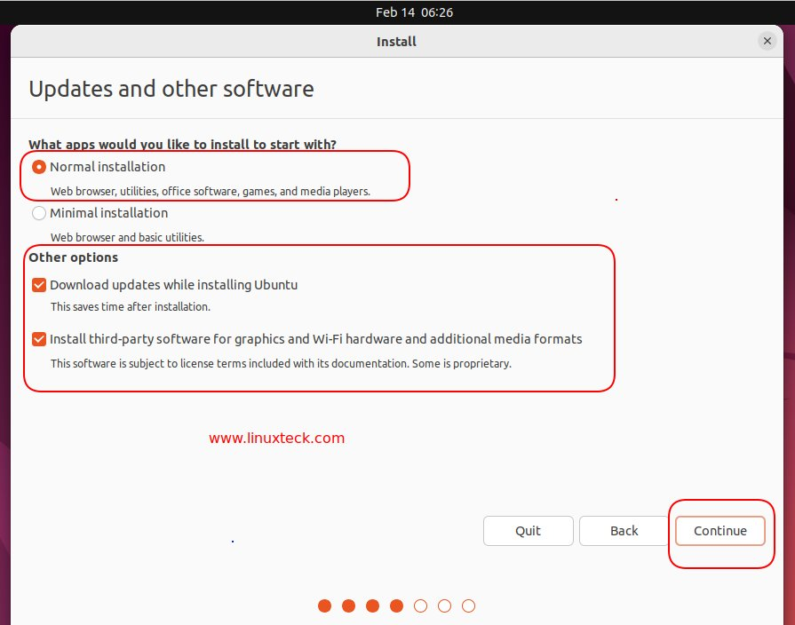
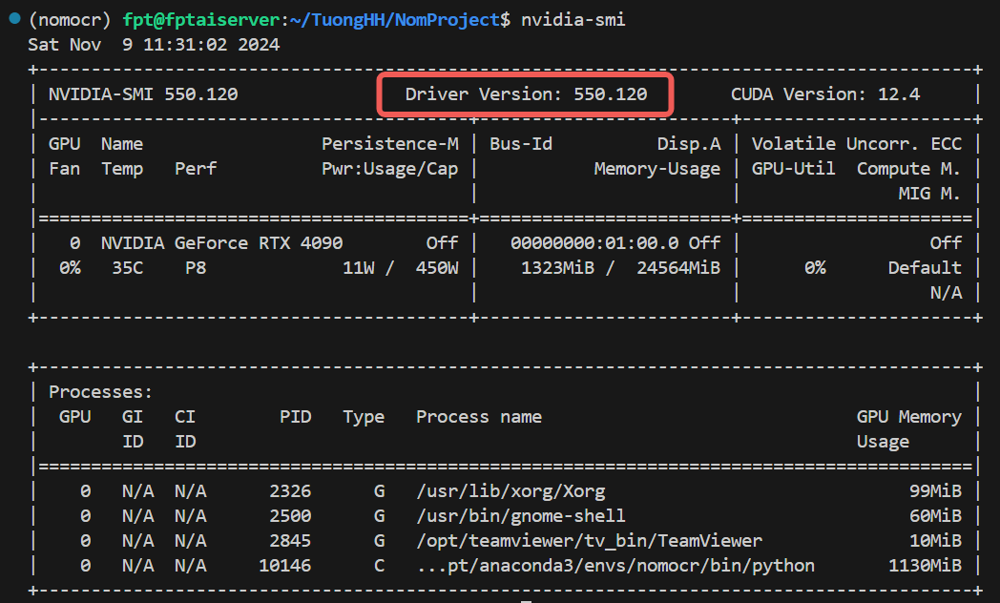

# Installation Guide for Ubuntu 22.04 with NVIDIA Drivers and Docker

This comprehensive guide provides step-by-step instructions on how to create a bootable Ubuntu 22.04 device, install NVIDIA GPU drivers, and set up Docker.

## Prerequisites

- A USB drive with at least 8GB of storage
- Internet connection
- Access to a system with an NVIDIA GPU
- Ubuntu or an Ubuntu derivative (such as Linux Mint)
- sudo privileges

## Step 1: Create a Bootable USB Drive

1. Download the Ubuntu 22.04 ISO file from the [official Ubuntu website](https://ubuntu.com/download/desktop).
2. Use a tool like balenaEtcher to create a bootable USB drive. Download it from [balena.io/etcher](https://www.balena.io/etcher/) or Rufus from [rufus.ie](https://rufus.ie/).
3. Open the tool and select the Ubuntu ISO file.
4. Insert the USB drive and select it as the target.
5. Click "Flash!" and wait for the process to complete.

## Step 2: Install Ubuntu 22.04

1. Insert the bootable USB drive into your computer and reboot.
2. Enter the boot menu (usually F12 or ESC, depending on the motherboard manufacturer).
3. Select the USB drive as the boot device.
4. Follow the Ubuntu installation prompts.
5. **Important**: At the **Updates and Other Software** step, ensure you tick the box under "Other options" to download updates and third-party applications for graphics, Wi-Fi, etc., if you have a good internet connection.

## Step 3: Install NVIDIA Drivers and CUDA Toolkit

1. Add the graphics drivers PPA:
   ```bash
   sudo add-apt-repository ppa:graphics-drivers/ppa
   sudo apt update
   sudo ubuntu-drivers autoinstall
   ```
2. Install CUDA Toolkit:
   ```bash
   sudo apt install nvidia-cuda-toolkit
   ```

## Step 4: Verify NVIDIA Driver Version

Ensure that the installed NVIDIA driver version is above 535:
```bash
nvidia-smi
```

Check the driver version in the output and ensure it meets the requirement. If not, uninstall the current driver and install the suitable version.

## Step 5: Set Up Docker's apt Repository

1. Update your package index and install prerequisites:
   ```bash
   sudo apt-get update
   sudo apt-get install ca-certificates curl
   sudo install -m 0755 -d /etc/apt/keyrings
   sudo curl -fsSL https://download.docker.com/linux/ubuntu/gpg -o /etc/apt/keyrings/docker.asc
   sudo chmod a+r /etc/apt/keyrings/docker.asc
   ```
2. Add the Docker repository:
   ```bash
   echo "deb [arch=$(dpkg --print-architecture) signed-by=/etc/apt/keyrings/docker.asc] https://download.docker.com/linux/ubuntu $(. /etc/os-release and echo "$VERSION_CODENAME") stable" | sudo tee /etc/apt/sources.list.d/docker.list > /dev/null
   sudo apt-get update
   ```
   **Note**: If you're using an Ubuntu derivative like Linux Mint, replace `$(. /etc/os-release && echo "$VERSION_CODENAME")` with your `UBUNTU_CODENAME`.

## Step 6: Install Docker

1. Install Docker packages:
   ```bash
   sudo apt-get install docker-ce docker-ce-cli containerd.io docker-buildx-plugin docker-compose-plugin
   ```
2. Verify installation by running the hello-world image:
   ```bash
   sudo docker run hello-world
   ```

## Step 7: Configure Docker User Permissions

1. Create the docker group:
   ```bash
   sudo groupadd docker
   ```
2. Add your user to the docker group:
   ```bash
   sudo usermod -aG docker $USER
   ```
3. Log out and back in to re-evaluate group membership or use `newgrp docker` to activate the changes immediately.

4. Verify that you can run Docker commands without sudo:
   ```bash
   docker run hello-world
   ```

## Step 8: Resolve Permissions Errors

If you encounter permission errors, fix them by adjusting the `.docker` directory permissions:
```bash
sudo chown "$USER":"$USER" /home/"$USER"/.docker -R
sudo chmod g+rwx "$HOME/.docker" -R
```

## Step 9: Configure Docker to Start on Boot

Enable Docker to start on boot:
```bash
sudo systemctl enable docker.service
sudo systemctl enable containerd.service
```
To disable this behavior:
```bash
sudo systemctl disable docker.service
sudo systemctl disable containerd.service
```

## Step 10: Configure Docker to Use NVIDIA Container Toolkit

1. Set up the NVIDIA container toolkit:
   ```bash
   curl -fsSL https://nvidia.github.io/libnvidia-container/gpgkey | sudo gpg --dearmor -o /usr/share/keyrings/nvidia-container-toolkit-keyring.gpg   && curl -s -L https://nvidia.github.io/libnvidia-container/stable/deb/nvidia-container-toolkit.list |     sed 's#deb https://#deb [signed-by=/usr/share/keyrings/nvidia-container-toolkit-keyring.gpg] https://#g' |     sudo tee /etc/apt/sources.list.d/nvidia-container-toolkit.list
   sudo apt-get update
   sudo apt-get install -y nvidia-container-toolkit
   ```

2. Configure the Docker daemon:
   ```bash
   sudo systemctl restart docker
   ```

3. If using Docker in rootless mode, configure as follows:
   ```bash
   systemctl --user restart docker
   ```

4. Configure `/etc/nvidia-container-runtime/config.toml` by using the sudo nvidia-ctk command:
   ```bash
   sudo nvidia-ctk config --set nvidia-container-cli.no-cgroups --in-place
   ```


## Some note for me only ○( ＾皿＾)っ Hehehe…

To install the necessary libraries for your project, follow these steps:

1. Install TensorFlow with CUDA support:
    ```bash
    pip install tensorflow[and-cuda]==2.14.0
    ```

2. Install CUDA Toolkit:
    ```bash
    conda install nvidia/label/cuda-11.8.0::cuda-toolkit -c nvidia/label/cuda-11.8.0
    ```

3. Install cuDNN:
    ```bash
    conda install -c conda-forge cudnn
    ```

4. If you encounter any cuDNN errors, refer to this [gist](https://gist.github.com/bennyistanto/46d8cfaf88aaa881ec69a2b5ce60cb58) for troubleshooting.

5. Set the `LD_LIBRARY_PATH` environment variable:
    ```bash
    export LD_LIBRARY_PATH=$CONDA_PREFIX/lib:$LD_LIBRARY_PATH
    ```

